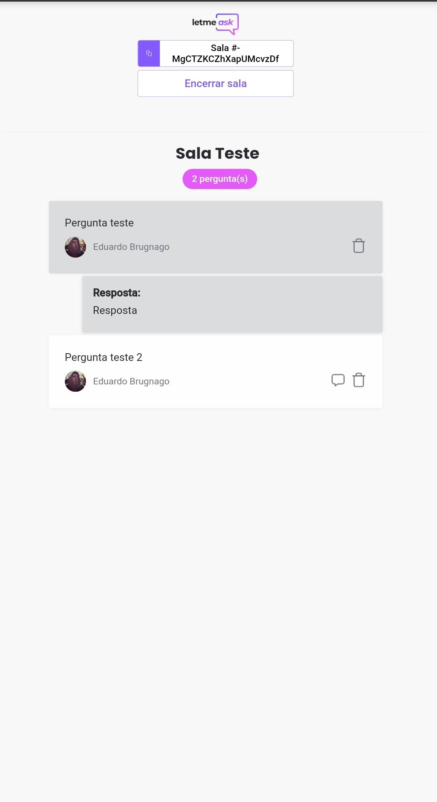

# NLW-06-LetMeAsk
<p align="center">
  
</p>

<h1 align="center">
    
</h1>

<p float="center">
  
  
</p>

## Sobre 📖
Este projeto foi elaborado em React com a utilização do banco de dados realtime Firebase(google) e hospedado também no firebase. A Aplicação chama-se Letmeask, uma plataforma onde um host cria uma sala e as pessoas entram para fazer perguntas. Pelo lado do administrador da sala é possivel fechar a sala, marcar as perguntas para responder, respondela e por fim apaga-la. Pelo lado do usuário é possivel logar e deslogar a sua conta, fazer perguntas e curtir outras perguntas.


## 🧪 Tecnologias
Esse projeto foi desenvolvido usando as seguintes tecnologia:

- [React](https://reactjs.org/).
- [Firebase](https://firebase.google.com/).
- [TypeScript](https://www.typescriptlang.org/).
- [SCSS](https://sass-lang.com/).

## 🔖 Site

Você pode ver o projeto rodando pelo link abaixo:

- https://letmeask-e6684.web.app/

## 🔃Clonar o projeto

```bash
$ git clone https://github.com/EduardoBrugnago/NLW-06-LetMeAsk
$ cd letmeask
```
Para concluir:
```bash
# Instalar as dependencias.
$ yarn

# Iniciar o projeto.
$ yarn start
```

---

<p align="center">Developed by 🚀 Rocketseat. Reproduced by: <a href="https://github.com/EduardoBrugnago/">Eduardo Brugnago.</p>
